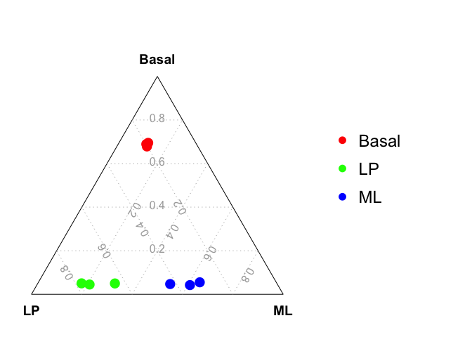
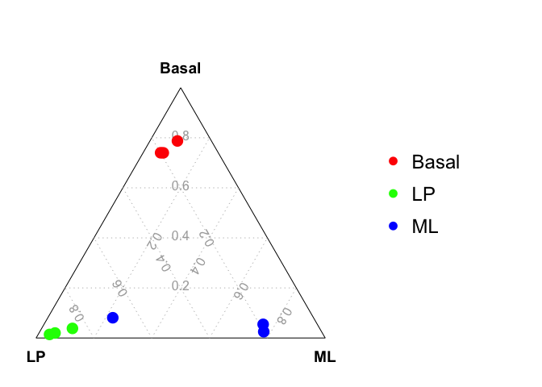

<!-- README.md is generated from README.Rmd. Please edit that file -->

# scTernary

<!-- badges: start -->
<!-- badges: end -->

The goal of scTernary is to perform ternary plot analysis for single
cell RNA-seq data.

## Installation

The *scTernary* package can be installed from GitHub by using:

``` r
devtools::install_github("jinming-cheng/scTernary")
```

## Examples

### A simple ternary plot analysis

This is a basic example of drawing a ternary plot.

``` r
library(scTernary)

data_for_ternary = data.frame(Basal = c(1,2,2,0,0,1,0,1,0),
                              ML    = c(0,1,0,1,2,2,0,0,1),
                              LP    = c(0,0,1,0,1,0,1,2,2) )

vcdTernaryPlot(data = data_for_ternary,
               group = rep(c("Bas","ML","LP"),each=3),
               group_levels = c("Bas","LP","ML"),
               group_color = c("red","green","blue"),
               point_size = 1,
               legend_point_size = 0.6)
```


### Ternary plot analysis using a constant cut-off

The ternary plot analysis using a constant cut-off can be applied to
single cell RNA-seq data with raw count cut-off of 0. Here, we use a
small bulk RNA-seq dataset to show the ternary plot analysis with a CPM
cut-off of 100. The ternary plot analysis for Fluidigm C1 data is
similar to that for bulk RNA-seq data.

Example bulk RNA-seq data (using CPM)

``` r
cpm = edgeR::cpm(example_dge_data$counts)
```

Three samples for each group

``` r
example_dge_data$samples$group
#> [1] LP    ML    Basal Basal ML    LP    Basal ML    LP   
#> Levels: Basal LP ML
```

Generate data for ternary plot usng a CPM cut-off of 100

``` r
data_for_ternary = generate_data_for_ternary(
  data_exp_mat = cpm,
  anno_signature_genes = anno_signature_genes_mouse,
  gene_name_col = "GeneID",
  gene_type_col = "gene_type",
  weight_by_gene_count = TRUE,
  cutoff_exp = 100,
  prior_count = 2
)
```

``` r
head(data_for_ternary)
#>                Basal         LP         ML
#> 10_6_5_11 0.02244898 0.34579439 0.07750473
#> 9_6_5_11  0.02040816 0.16822430 0.29300567
#> purep53   0.21020408 0.06074766 0.03402647
#> JMS8-2    0.21496599 0.05841121 0.03591682
#> JMS8-3    0.02380952 0.21495327 0.26654064
#> JMS8-4    0.02040816 0.33878505 0.09451796
```

Drawing the ternary plot

``` r
vcdTernaryPlot(data = data_for_ternary,
  order_colnames = c(2,3,1),
  group = example_dge_data$samples$group,
  group_color = c("red","green","blue"),
  point_size = 1,
  show_legend = TRUE,
  legend_point_size = 0.6,
  legend_position = c(0.3,0.5),
  scale_legend = 1)
```



### Ternary plot analysis using estimated cut-offs

We can also find the optimized cut-off for each sample (or cell) to
calculate the signature gene proportion for the sample (or cell). The
optimized cut-off is estimated by maximizing the coefficient of
variation (CV) of the signature gene proportion by a grid search method.

Example bulk RNA-seq data (using logCPM)

``` r
lcpm = edgeR::cpm(example_dge_data$counts,log = TRUE)
```

Three samples for each group

``` r
example_dge_data$samples$group
#> [1] LP    ML    Basal Basal ML    LP    Basal ML    LP   
#> Levels: Basal LP ML
```

Estimate a optimized cut-off for each sample (or cell)

``` r
estimated_cutoffs = estimate_optimized_cutoffs(
  data_exp_mat = lcpm,
  anno_signature_genes = anno_signature_genes_mouse,
  gene_name_col = "GeneID",
  gene_type_col = "gene_type",
  weight_by_gene_count = TRUE,
  prior_count = 2,
  do_parallel = TRUE,
  n_cores = 2
)
```

Generate data for ternary plot

``` r
data_for_ternary = generate_data_for_ternary(
  data_exp_mat = lcpm,
  anno_signature_genes = anno_signature_genes_mouse,
  gene_name_col = "GeneID",
  gene_type_col = "gene_type",
  weight_by_gene_count = TRUE,
  cutoff_exp = estimated_cutoffs,
  prior_count = 2
)
```

``` r
head(data_for_ternary)
#>                 Basal          LP          ML
#> 10_6_5_11 0.001360544 0.091121495 0.003780718
#> 9_6_5_11  0.001360544 0.004672897 0.018903592
#> purep53   0.100000000 0.025700935 0.009451796
#> JMS8-2    0.031292517 0.004672897 0.003780718
#> JMS8-3    0.001360544 0.011682243 0.003780718
#> JMS8-4    0.001360544 0.063084112 0.003780718
```

Drawing the ternary plot

``` r
vcdTernaryPlot(data = data_for_ternary,
  order_colnames = c(2,3,1),
  group = example_dge_data$samples$group,
  group_color = c("red","green","blue"),
  point_size = 1,
  show_legend = TRUE,
  legend_point_size = 0.6,
  legend_position = c(0.3,0.5),
  scale_legend = 1)
```


