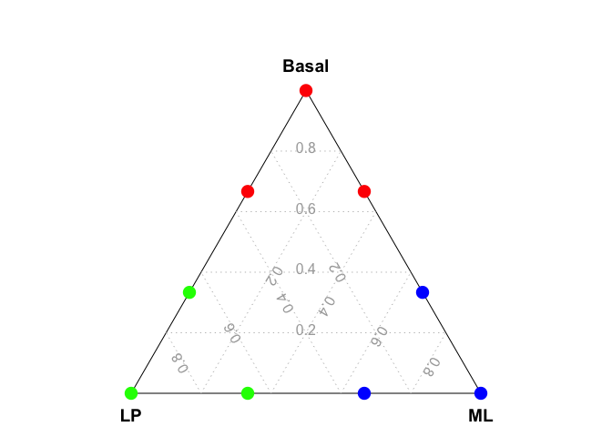

<!-- README.md is generated from README.Rmd. Please edit that file -->

# scTernary

<!-- badges: start -->
<!-- badges: end -->

The goal of scTernary is to perform ternary plot analysis for single
cell RNA-seq data.

## Installation

The *scTernary* package can be installed from GitHub by using:

``` r
devtools::install_github("jinming-cheng/scTernary")
```

## Example

This is a basic example of drawing a ternary plot.

``` r
library(scTernary)

data_for_ternary = data.frame(Basal = c(1,2,2,0,0,1,0,1,0),
                              ML    = c(0,1,0,1,2,2,0,0,1),
                              LP    = c(0,0,1,0,1,0,1,2,2) )

vcdTernaryPlot(data = data_for_ternary,
               group = rep(c("Bas","ML","LP"),each=3),
               group_levels = c("Bas","LP","ML"),
               group_color = c("red","green","blue"),
               point_size = 1,
               legend_point_size = 0.6)
```


